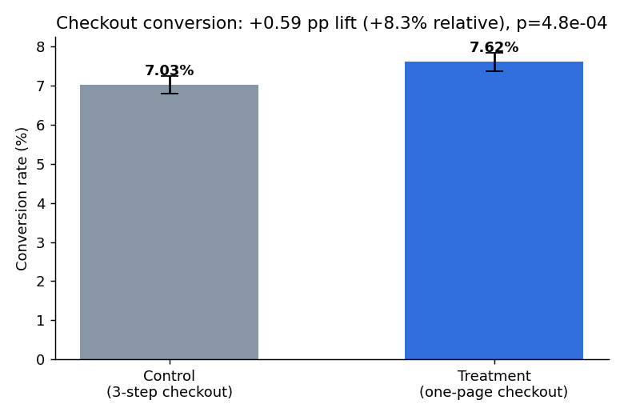
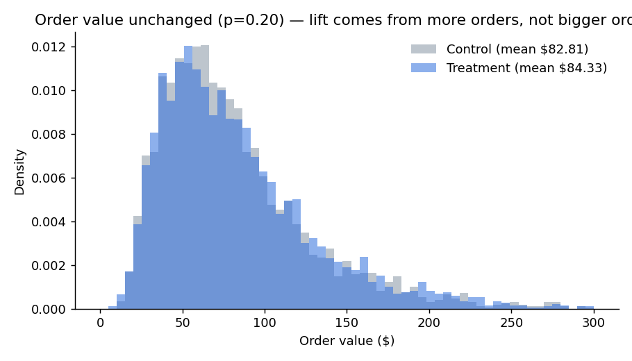
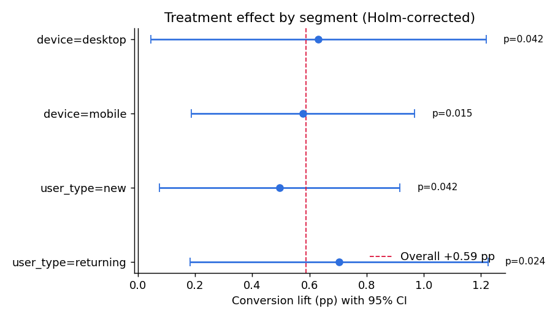
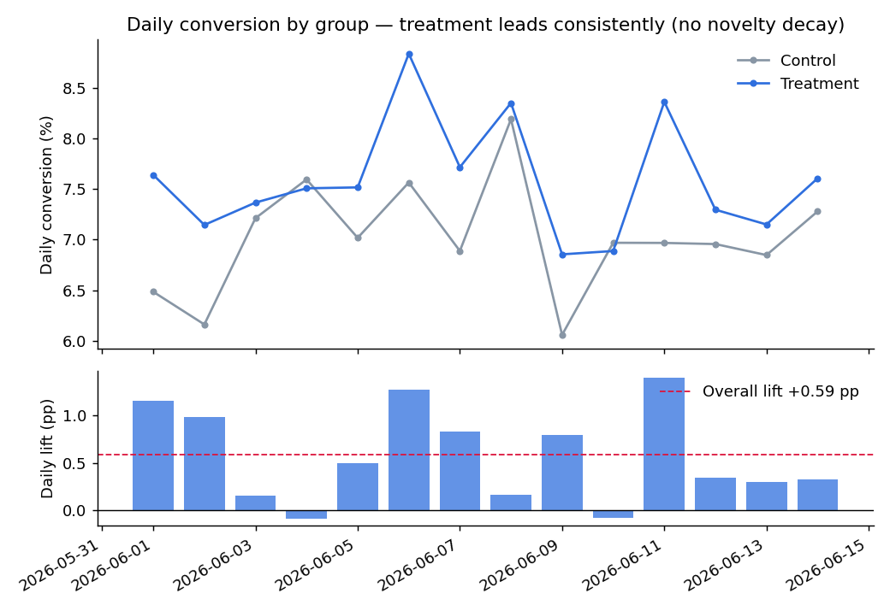

# A/B Testing: One-Page Checkout Redesign

**Verdict: Ship it.** The new one-page checkout lifted purchase conversion by **+0.59 pp (+8.3% relative, p = 4.8e-04)** with no damage to order value or refund rates — worth an estimated **~$1.2M/year** in incremental revenue at 2.5M annual checkout visitors.



## The experiment

An e-commerce retailer wants to replace its three-step checkout with a one-page checkout. Visitors reaching checkout during a 14-day window were randomized 50/50:

| | Control | Treatment |
|---|---|---|
| Experience | 3-step checkout | One-page checkout |
| Visitors | 47,787 | 48,213 |
| **Conversion** | **7.03%** | **7.62%** |

- **Primary metric:** purchase conversion
- **Secondary metrics:** average order value (AOV), checkout completion time
- **Guardrail:** refund rate (a faster checkout could drive impulse buys → returns)

> **Note on the data:** this is a *simulated* experiment with a known ground truth (+1.0 pp true effect on mobile, +0.4 pp on desktop, ~+0.77 pp blended; zero true effect on AOV and refunds). That's deliberate — it lets the project validate the statistical pipeline itself: the 95% CI [+0.26, +0.92] pp correctly captures the true blended effect, and the pipeline correctly finds *no* effect where none exists (AOV, refunds). The generator is in [`src/generate_data.py`](src/generate_data.py); swap in any real experiment export with the same schema and the analysis runs unchanged.

## Analysis walkthrough

All statistics are implemented from first principles (numpy + stdlib `NormalDist`) — no black-box test functions.

### 1. Sanity first: Sample Ratio Mismatch check
Randomization produced 47,787 vs 48,213 — χ²(1) = 1.89, p = 0.17. No SRM; the split is consistent with 50/50, so the experiment is valid to analyze.

### 2. Power analysis
With ~48K per arm and a 7.03% baseline, the minimum detectable effect at 80% power (two-sided α = 0.05) is **0.46 pp** (6.6% relative). The experiment was properly powered for the effect size the team cared about.

### 3. Primary metric: conversion
Two-proportion z-test: **+0.59 pp lift, 95% CI [+0.26, +0.92] pp, z = 3.49, p = 4.8e-04.** Significant, and the entire CI sits above zero.

### 4. Secondary metrics
- **AOV:** $82.81 vs $84.33 — bootstrap 95% CI for the difference [−$0.77, +$3.85], p = 0.20. **No detectable change** — the extra revenue comes from more orders, not bigger ones.
- **Checkout time:** 186s → 139s (**−47s**, p < 1e-15). The redesign does what it promised.



### 5. Guardrail: refunds
3.39% vs 3.81%, p = 0.35 — **passed**. No significant increase in refunds from the faster flow.

### 6. Segmentation (Holm-corrected)
Because testing many segments inflates false positives, segment p-values use the Holm-Bonferroni correction. The lift is positive and significant in **every** segment — this isn't an effect driven by one pocket of users:

| Segment | Lift (pp) | 95% CI | p (Holm) |
|---|---|---|---|
| Mobile | +0.58 | [0.19, 0.97] | 0.015 |
| Desktop | +0.63 | [0.05, 1.22] | 0.042 |
| New users | +0.50 | [0.07, 0.92] | 0.042 |
| Returning users | +0.70 | [0.18, 1.23] | 0.024 |



### 7. Novelty check
Week-1 average daily lift (+0.69 pp) vs week-2 (+0.46 pp) — the effect persists across the full test window rather than decaying after launch buzz.



### 8. Business impact
At 2.5M checkout visitors/year and a blended AOV of $83.60, the measured lift translates to **~14,700 extra orders ≈ $1.23M incremental revenue per year** (95% CI $0.54M – $1.92M).

## Repo structure

```
├── data/checkout_ab_test.csv      # 96,000 visitors, 10 columns
├── notebooks/ab_test_analysis.ipynb   # interactive walkthrough
├── src/
│   ├── generate_data.py           # seeded data generator (ground truth documented)
│   └── run_analysis.py            # full scripted analysis → figures + summary.json
├── figures/                       # generated charts
└── results/summary.json           # all key metrics, machine-readable
```

## Reproduce

```bash
pip install -r requirements.txt
python src/generate_data.py    # regenerate data (seeded, deterministic)
python src/run_analysis.py     # run analysis, write figures + summary.json
```

## What I'd do differently with real data

- Use CUPED or regression adjustment with pre-experiment covariates to tighten CIs
- Run a longer test if weekly seasonality mattered to the business
- Add sequential testing / alpha-spending if stakeholders demanded early peeks
- Log-transform or winsorize order values before mean-based tests at smaller sample sizes
